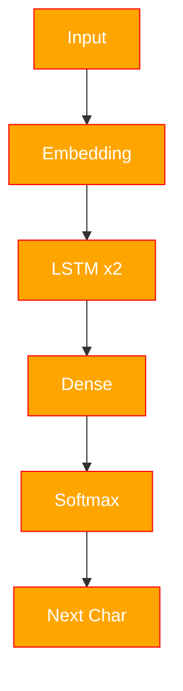

# CharSeqGen

descrp

### Context


### Architecture



### Estimated

| Epoch | Loss |
|---|---|
| 0 | 1.466 |
| 1 | 1.266 |
| 2 | 1.222 |
| 3 | 1.200 |
| 4 | 1.185 |
| 5 | 1.172 |
| 6 | 1.163 |


<figure>

<figcaption>Рис. 1. Train-Loss</figcaption>
</figure>


### Structure

```text
project/
│
├── figure/                    # Figures and visualizations
├── models/                    # Neural network architectures
│   ├── tokenConfig/
|   |   ├── token.json
|  |  └── vocab.npy
|   |
|   ├── weight/
|   |   └── model.pth
|   |
│   ├── gen.py
|   └── pipeline.py

├── pre-book/                  # Processed text files / datasets
|   └── conversion.py
│
├── utils/                     # Utility functions
│
├── .gitignore
├── LICENSE
├── README.md
│
├── TestCases.ipynb            # Testing notebooks
├── WordVec.ipynb              # Word embeddings experiments
├── main.ipynb                 # Main training notebook
├── main.py                    # Main training script
│
├── BytePair.py                # Byte Pair Encoding tokenizer
├── CharTokenize.py            # Character tokenizer
├── figure.py                  # Plotting and visualization
└──              # Data conversion utilities
```