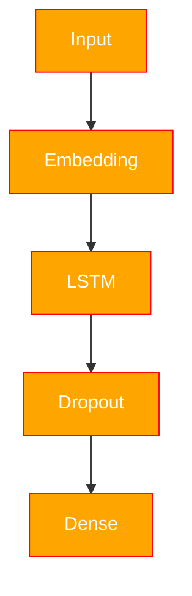

# CharSeqGen

A project for character-level text generation based on the books of Fyodor Mikhailovich Dostoevsky.

### Context

The project uses the following books by the author:
- Crime and Punishment
- The Brothers Karamazov
- Demons
- The Idiot
- The Adolescent

The dataset contains $6.588.976$ examples. The training data for the model is prepared using a shifting (offset) scheme. The text is split into fragments of 65 characters: the first 64 characters form the input sequence, and the last 64 characters form the target variable. Thus, the fragments are shifted relative to each other, as shown in the figure below.

<figure>

</figure>

### Architecture

The model architecture includes:



### Estimated

We use CrossEntropyLoss as the loss function. The results achieved are shown below.

<div align="center">

| Epoch | Loss |
|---|---|
| 0 | 1.466 |
| 1 | 1.266 |
| 2 | 1.222 |
| 3 | 1.200 |
| 4 | 1.185 |
| 5 | 1.172 |
| 6 | 1.163 |

</div>

As well as the training graph.

<figure>

</figure>

We use a text generation algorithm. The model receives the current token and computes logits for all possible next tokens. These logits are passed to Categorical, which converts them into a probability distribution using softmax. Then, the next token is randomly sampled from this distribution according to its probability. After that, the selected token is fed back into the model to generate the next character.

<div align="center">

| № | temp | Input | Output |
|---|---|---|---|
| 1 | ~1 | Любовь это | Любовь это веришь. Он мне просто совершилось пред тягимимость и сообразить об избу |
| 2 | ~0 | Любовь это | Любовь это совсем не понимаю, а все это было в самом деле стало быть, всем понимает |
| 3 | ~0 | Счастье, это когда я нахожусь в одиночестве самого себя | Счастье, это когда я нахожусь в одиночестве самого себя подавать на себя подлецом и принимаете в этом случае и не помнить по собственному человеку |
| 4 | ~1 | Счастье, это когда я нахожусь в одиночестве самого себя | Счастье, это когда я нахожусь в одиночестве самого себя. Сама вы ее не ужасно непременно подробному единственно натурально приехать когда поцеловать и мне любезень |
| 5 | ~1 | Он был один | Он был один и клеле на него, но даже между тем покажу вшеме приходиться, - продолжал наконец видел |
| 6 | ~0 | Он был один | Он был один из них в нашем преступлении прокурора, который все это произвело в своем роде |
| 7 | ~0 | Привет, друг | Привет, друг мой, с тобой в этом доме и настойчиво проговорил он вдруг |
| 8 | ~1 | Привет, друг | Привет, друг и убийство стало быть, природа вашего половину своей совершенно и простодушно |

</div>

### Structure

```text
project/
│
├── figure/                    # Figures and visualizations
├── models/                    # Neural network architectures
│   ├── tokenConfig/           # Tokenization vocabulary configuration
|   |   ├── token.json         # Vocabulary in json
|   |   └── vocab.npy          # Vocabulary in npy
|   |
|   ├── weight/
|   |   └── model.pth          # Saved Torch model
|   |
│   ├── gen.py                 # Text generation program using our model
|   └── pipeline.py            # Model training pipeline
|
├── pre-book/                  # Processed text files / datasets
|   └── conversion.py
│
├── utils/                     # Utility functions
|    ├── BytePair.py           # BPE Tokenization
|    ├── CharTokenize.py       # Char Tokenization
|    └── figure.py             # Program for plotting the model training graph
│
├── TestCases.ipynb            # Text generation use cases
├── WordVec.ipynb              # Word embeddings experiments
├── main.ipynb                 # Main training notebook
├── main.py                    # Main training script
└──
```