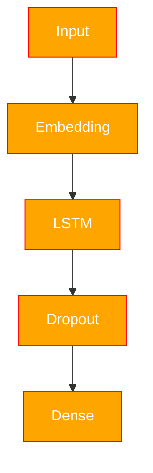

# CharSeqGen

Проект посимвольной генерации по книгам Достоевского Фёдора Михайловича. 

### Context

В проект используются следующие книги автора:

- Преступление и наказание
- Братья Карамазовы
- Бесы
- Идиот
- Подросток

<figure>

<figcaption>Fig. 1. Пример смещения Input and Target</figcaption>
</figure>


### Architecture



### Estimated

<div align="center">

| Epoch | Loss |
|---|---|
| 0 | 1.466 |
| 1 | 1.266 |
| 2 | 1.222 |
| 3 | 1.200 |
| 4 | 1.185 |
| 5 | 1.172 |
| 6 | 1.163 |

</div>

<figure>

<figcaption>Fig. 2. Train-Loss</figcaption>
</figure>


### Structure

```text
project/
│
├── figure/                    # Figures and visualizations
├── models/                    # Neural network architectures
│   ├── tokenConfig/
|   |   ├── token.json
|   |   └── vocab.npy
|   |
|   ├── weight/
|   |   └── model.pth
|   |
│   ├── gen.py
|   └── pipeline.py
|
├── pre-book/                  # Processed text files / datasets
|   └── conversion.py
│
├── utils/                     # Utility functions
|    ├── BytePair.py
|    ├── CharTokenize.py
|    └── figure.py
│
├── TestCases.ipynb            # Testing notebooks
├── WordVec.ipynb              # Word embeddings experiments
├── main.ipynb                 # Main training notebook
├── main.py                    # Main training script
└──
```