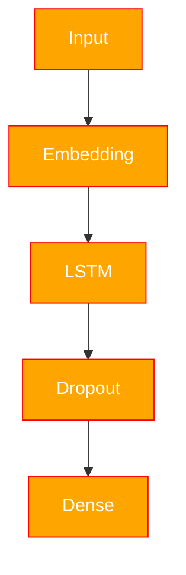

# CharSeqGen

A project for character-level text generation based on the books of Fyodor Mikhailovich Dostoevsky.

### Context

The project uses the following books by the author:
- Crime and Punishment
- The Brothers Karamazov
- Demons
- The Idiot
- The Adolescent

The dataset contains $6.588.976$ examples. The training data for the model is prepared using a shifting (offset) scheme. The text is split into fragments of 65 characters: the first 64 characters form the input sequence, and the last 64 characters form the target variable. Thus, the fragments are shifted relative to each other, as shown in the figure below.

<figure>

</figure>

### Architecture

The model architecture includes:



### Estimated

<div align="center">

| Epoch | Loss |
|---|---|
| 0 | 1.466 |
| 1 | 1.266 |
| 2 | 1.222 |
| 3 | 1.200 |
| 4 | 1.185 |
| 5 | 1.172 |
| 6 | 1.163 |

</div>

<figure>

</figure>


### Structure

```text
project/
│
├── figure/                    # Figures and visualizations
├── models/                    # Neural network architectures
│   ├── tokenConfig/
|   |   ├── token.json
|   |   └── vocab.npy
|   |
|   ├── weight/
|   |   └── model.pth
|   |
│   ├── gen.py
|   └── pipeline.py
|
├── pre-book/                  # Processed text files / datasets
|   └── conversion.py
│
├── utils/                     # Utility functions
|    ├── BytePair.py
|    ├── CharTokenize.py
|    └── figure.py
│
├── TestCases.ipynb            # Testing notebooks
├── WordVec.ipynb              # Word embeddings experiments
├── main.ipynb                 # Main training notebook
├── main.py                    # Main training script
└──
```